Lastejobb for geometri for [Norske naturvernområder](https://github.com/Artsdatabanken/naturvern-kart).

## Dataflyt

## Utdatasett

Datasettet som er resultatet av lastejobben havner i repo [naturvern-kart](https://github.com/Artsdatabanken/naturvern-kart).

## Baserer seg på åpne data fra (takk til)

- [Miljødirektoratet: Naturvernområder](https://kartkatalog.geonorge.no/metadata/miljodirektoratet/naturvernomrader/5857ec0a-8d2c-4cd8-baa2-0dc54ae213b4)

### Leses av

- [nin-data-lastejobb](https://github.com/Artsdatabanken/nin-data-lastejobb)

### Bruk i sluttprodukter

- [Natur i Norge kart](https://github.com/Artsdatabanken/nin-kart-frontend)
- [Artsdatabanken åpne data](https://data.artsdatabanken.no/)
